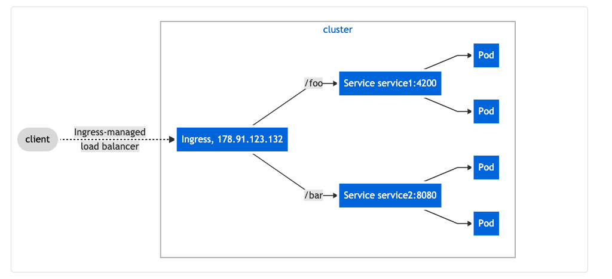

# Ingress Network:

Ingress exposes HTTP and HTTPS routes from outside the cluster to services within the cluster. Traffic routing is controlled by rules defined on the Ingress resource.

You must have an Ingress controller to satisfy an Ingress. Only creating an Ingress resource has no effect.

If none of the hosts or paths match the HTTP request in the Ingress objects, the traffic is routed to your default backend.

If you create an Ingress resource without any hosts defined in the rules, then any web traffic to the IP address of your Ingress controller can be matched without a name based virtual host being required.

General Example:
```yaml
apiVersion: networking.k8s.io/v1
kind: Ingress
metadata:
  name: minimal-ingress
  annotations:
    nginx.ingress.kubernetes.io/rewrite-target: /
spec:
  rules:
  - http:
      paths:
      - path: /testpath
        pathType: Prefix
        backend:
          service:
            name: test
            port:
              number: 80
```



This setup would require:
```yaml
apiVersion: networking.k8s.io/v1
kind: Ingress
metadata:
  name: simple-fanout-example
spec:
  rules:
  - host: foo.bar.com
    http:
      paths:
      - path: /foo
        pathType: Prefix
        backend:
          service:
            name: service1
            port:
              number: 4200
      - path: /bar
        pathType: Prefix
        backend:
          service:
            name: service2
            port:
              number: 8080

```