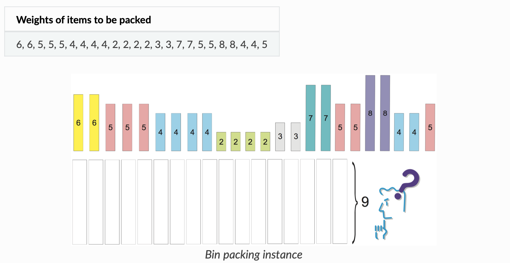

# 1- Deployment Evolution

### Traditional:

Physical, no boundaries

Issues: resource allocation, underperform, under utilize, expensive

### Virtualized:

Isolation, security, better utilization, better scalability, reduce hardware costs

### Containered:

Relaxed version of isolation in VMs -> lightweight, but still have their own filesystem, share of CPU, memory, process space, ..

Benefits:
- Agile application creation and deployment //super fast and light
- Continuous development, integration, and deployment //images are immutabile
- Dev and Ops separation of concerns
- Environmental consistency //all OSs, CPs, machines
- Application-centric management: running an application on an OS using logical resources instead of running an OS on virtual hardware
- Loosely coupled, distributed, elastic, liberated micro-services
- Resource isolation //predictable application performance.
- Resource utilization //high efficiency and density.

# 2- What is Kubernetes?

Portable, extensible, open-source platform for managing containerized workloads and services, takes care of scaling and failover for your application, provides deployment patterns

- Service discovery and load balancing
- Storage orchestration Kubernetes: local storages, public cloud providers, and more.
- Automated rollouts and rollbacks
- Automatic bin packing based on CPU and memory (RAM)

- Self-healing: restarts, replaces, kills containers
- Secret and configuration management: It stores sensitive data aside from container images, and without exposing them.

# 3- Kubernetes Components:
<!-- 

 -->

Deployed Kubernetes => Cluster

Cluster => 1+ Worker Nodes, 1 control plane

Node => Host the pods, Run containerized apps

Pod => Smallest deployable unit, 1+ containers (apps, init and ephermal containers)
